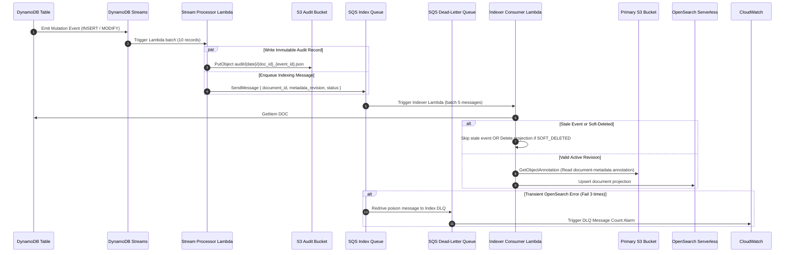
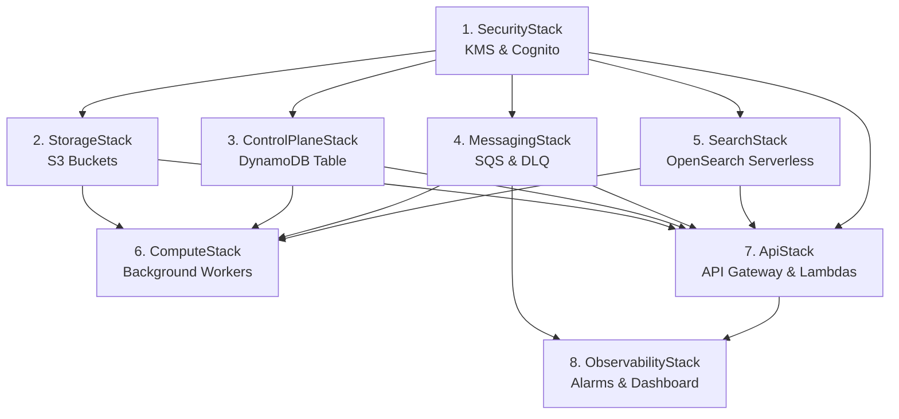

# AWS Document Management Platform - Solution Architecture Specification

## Table of Contents
1. [Executive Summary & Solution Overview](#1-executive-summary--solution-overview)
   - [1.1 Core Authority Model](#11-core-authority-model)
   - [1.2 Interplay & Architectural Necessity: S3 Annotations vs. DynamoDB Control Plane](#12-interplay--architectural-necessity-s3-annotations-vs-dynamodb-control-plane)
   - [1.3 Solution Scope Boundaries & Phased Roadmap](#13-solution-scope-boundaries--phased-roadmap)
2. [AWS Services Inventory & Architectural Justifications](#2-aws-services-inventory--architectural-justifications)
3. [Data Architecture & Storage Models](#3-data-architecture--storage-models)
   - [3.1 S3 Storage Partitioning & Native Object Annotations](#31-s3-storage-partitioning--native-object-annotations)
   - [3.2 Authoritative Annotation Schema (`bank.document-metadata/1`)](#32-authoritative-annotation-schema-bankdocument-metadata1)
   - [3.3 DynamoDB Single-Table Design (`doc-platform-mvp-control`)](#33-dynamodb-single-table-design-doc-platform-mvp-control)
   - [3.4 OpenSearch Serverless Index Mapping (`documents-v1`)](#34-opensearch-serverless-index-mapping-documents-v1)
4. [Enterprise Design Patterns & Production Scalability](#4-enterprise-design-patterns--production-scalability)
   - [4.1 Dynamic Multi-Tenant Schema Registry](#41-dynamic-multi-tenant-schema-registry)
   - [4.2 Zero Cold-Start Precompiled Schema Compilation](#42-zero-cold-start-precompiled-schema-compilation)
5. [End-to-End API Sequence Flows (15 Operations)](#5-end-to-end-api-sequence-flows-15-operations)
6. [Security, Governance & Compliance](#6-security-governance--compliance)
   - [6.1 Role-Based Access Control (RBAC) Matrix](#61-role-based-access-control-rbac-matrix)
7. [Deployment & Infrastructure as Code (AWS CDK)](#7-deployment--infrastructure-as-code-aws-cdk)
   - [7.1 Stack Dependency Graph](#71-stack-dependency-graph)
   - [7.2 Step-by-Step Deployment Instructions](#72-step-by-step-deployment-instructions)
   - [7.3 Resource Retention & Teardown](#73-resource-retention--teardown)
8. [Failure Handling, Consistency & Background Reconciliation](#8-failure-handling-consistency--background-reconciliation)
   - [8.1 Idempotency Enforcement](#81-idempotency-enforcement)
   - [8.2 Cross-Service Consistency Management](#82-cross-service-consistency-management)
   - [8.3 Scheduled Background Reconciliation Worker](#83-scheduled-background-reconciliation-worker)
9. [Testing Strategy & Acceptance Criteria](#9-testing-strategy--acceptance-criteria)
   - [9.1 Functional Acceptance Criteria](#91-functional-acceptance-criteria)
   - [9.2 Reliability & Performance Targets](#92-reliability--performance-targets)
10. [Step-by-Step E2E Verification & Demonstration Script](#10-step-by-step-e2e-verification--demonstration-script)
11. [Known Architectural Limitations & Risk Governance Matrix](#11-known-architectural-limitations--risk-governance-matrix)
- [Appendix A: Authoritative Source-of-Truth Statement](#appendix-a-authoritative-source-of-truth-statement)
- [Appendix B: Definition of Done (DoD)](#appendix-b-definition-of-done-dod)

---

## 1. Executive Summary & Solution Overview

The **AWS Document Management Platform** is an enterprise-grade, cloud-native document management solution built entirely on AWS managed and serverless services. Designed as a modern, decoupled enterprise architecture, the system provides high-performance document ingestion, strict immutable content versioning, authoritative metadata management with optimistic concurrency control, multi-attribute search indexing, and role-based access governance.

```text
+----------------------------------------------------------------------------------------------------+
|                                    CONSUMER / CLIENT APPLICATION                                   |
+----------------------------------------------------------------------------------------------------+
                                                  |
                                    HTTPS / REST  | (JWT Bearer Token)
                                                  v
+----------------------------------------------------------------------------------------------------+
|                            AMAZON API GATEWAY (REST API + COGNITO AUTHORIZER)                      |
+----------------------------------------------------------------------------------------------------+
         |                                        |                                        |
         | (Command Routes)                       | (Query Routes)                         | (Search Route)
         v                                        v                                        v
+--------------------+                  +--------------------+                  +--------------------+
| COMMAND API LAMBDA |                  |  QUERY API LAMBDA  |                  | SEARCH API LAMBDA  |
+--------------------+                  +--------------------+                  +--------------------+
   |         |         |                   |         |                                     |
   |         |         |                   |         +---------------------------+         |
   |         |         |                   |                                     |         |
   |         |         v                   v                                     |         v
   |         |   +----------------------------+                                  |   +---------------+
   |         |   |      AMAZON DYNAMODB       |                                  |   |   OPENSEARCH  |
   |         |   | (Control Plane & Pointers) |                                  |   |  SERVERLESS   |
   |         |   +----------------------------+                                  |   | (Search Index)|
   |         |                 |                                                 |   +---------------+
   |         v                 v (DynamoDB Streams)                              |           ^
   |   +---------------+   +-----------------------------+                       |           |
   |   |   AMAZON S3   |   | STREAM PROCESSOR (LAMBDA)   |                       |           | (Upsert/
   |   | (Binary Store)|   +-----------------------------+                       |           |  Delete)
   |   +---------------+            |             |                              |           |
   |         ^                      v             v                              |           |
   |         | (Metadata     +-------------+  +-------------------+              |     +-------------+
   +---------+  Annotation)  |  S3 AUDIT   |  |  AMAZON SQS       |              |     |   INDEXER   |
                             |   BUCKET    |  |  (Indexing Queue) |=============>|====>|  (LAMBDA)   |
                             +-------------+  +-------------------+              |     +-------------+
                                                       | (Failure x3)            |
                                                       v                         |
                                              +-------------------+              |
                                              |   AMAZON SQS DLQ  |              |
                                              +-------------------+              |
                                                       |                         |
                                                       v                         |
                                              +-------------------+              |
                                              | CLOUDWATCH ALARMS |<-------------+
                                              +-------------------+
```

### 1.1 Core Authority Model
To maintain strict data integrity without distributed two-phase commit transactions, the architecture enforces a rigorous **Authority Model**:

1. **Content Authority (Amazon S3 Object Versions):**
   - S3 is the absolute, immutable source of truth for raw document binaries (PDF, TIFF, JPEG, Office).
   - Every content update to a logical document key creates a new, immutable `S3 VersionId`. Application roles are explicitly denied `s3:DeleteObjectVersion` permissions.
2. **Metadata Authority (Amazon S3 Object Annotations):**
   - Each content version owns an authoritative, structured JSON annotation attached directly to the versioned S3 object via the native **Amazon S3 Annotations API** (`s3:PutObjectAnnotation`, `s3:GetObjectAnnotation`).
   - The annotation is named `document-metadata` and holds the complete system and business metadata conforming strictly to the document class schema (`bank.document-metadata/1`).
3. **Control Plane & Pointer Authority (Amazon DynamoDB):**
   - DynamoDB maintains the current pointer (`DOC#{document_id}`), mapping the logical document to its latest active `current_s3_version_id`, `current_application_version`, and `current_metadata_revision`.
   - DynamoDB also acts as the concurrency coordinator, idempotency registry, upload session tracker, and version lineage catalog.
4. **Search Projection (Amazon OpenSearch Serverless):**
   - OpenSearch Serverless acts solely as a **derived read model (projection)** for current active documents.
   - It is asynchronously hydrated via DynamoDB Streams and SQS. If OpenSearch becomes unavailable, primary document retrieval, downloads, and mutations remain 100% operational via DynamoDB and S3.
5. **Audit Evidence (Amazon S3 Audit Bucket):**
   - Asynchronous stream events automatically write immutable audit logs partitioned by date to a dedicated KMS-encrypted S3 audit bucket.

### 1.2 Interplay & Architectural Necessity: S3 Annotations vs. DynamoDB Control Plane

A common architectural question in this design is: **If Amazon S3 Annotations store the authoritative document metadata, why is DynamoDB still necessary?**

While S3 Annotations solve the problem of binding rich, structured, mutable metadata directly to object versions without the 2 KB header limit or sidecar sprawl, **Amazon S3 is an object storage system, not a transactional database**. DynamoDB provides critical control plane capabilities that S3 cannot perform natively:

| Dimension / Capability | Amazon S3 & S3 Annotations | Amazon DynamoDB Control Table | Why DynamoDB Is Essential |
|---|---|---|---|
| **Authoritative Metadata Storage** | **Primary Authority** (Holds complete JSON conforming to `bank.document-metadata/1`) | Stores only lightweight pointer, revision count, and annotation ETag | S3 Annotations allow rich metadata to live directly with object versions, enabling open analytics (e.g. S3 Metadata Apache Iceberg) without sidecar files. |
| **Optimistic Concurrency Control (OCC)** | No conditional update expressions across arbitrary attributes | **Primary (`ConditionExpression`)** | On `PATCH /metadata`, DynamoDB atomically checks `current_metadata_revision = :expected` and commits the increment. S3 does not support atomic integer increments or complex conditional expressions, making DynamoDB necessary to prevent lost updates under concurrent edits. |
| **Active Version Pointer Resolution** | Requires full S3 bucket version listing | **Primary ($O(1)$ sub-millisecond lookup)** | DynamoDB instantly maps `DOC#{document_id}` to `current_s3_version_id` without paginating opaque S3 version markers. |
| **Sequential Version Lineage & History** | Non-sequential, opaque S3 version strings | **Primary (Sort-Key Indexed Querying)** | Querying `pk = DOC#{id} AND begins_with(sk, 'VER#')` retrieves ordered version history (`v1`, `v2`, `v3`) in a single indexed read without inspecting every S3 version annotation. |
| **Multi-Item Transactions & Idempotency** | No multi-object transactional API | **Primary (`TransactWriteItems`)** | Atomically updates the document pointer, records a new version, and commits client idempotency locks (`IDEMP#{client_id}#{key}`) in a single ACID transaction. |
| **Change Data Capture (CDC)** | Event notifications lack before/after diffs | **Primary (DynamoDB Streams)** | Emits ordered stream records containing `OldImage` and `NewImage` to reliably drive the asynchronous S3 audit logger and OpenSearch search indexing pipeline. |
| **Upload Session State Machine** | No application session tracking | **Primary (State machine with TTL)** | Coordinates direct multipart/presigned upload sessions (`INITIATED` → `ACTIVE`/`ABORTED`) with automated TTL cleanup. |
| **Logical Soft Deletion & Restoration** | No soft-delete concept without moving objects | **Primary (Status flag management)** | Instantly toggles `status: 'SOFT_DELETED'` and purges search projections while leaving WORM S3 binaries and annotations untouched for instant restore or compliance hold. |

### 1.3 Solution Scope Boundaries & Phased Roadmap

To maintain engineering discipline and establish clear delivery milestones, capabilities are explicitly partitioned into current solution scope versus deferred roadmap items:

#### A. Core Solution Scope (Included)
- **Document Classes:** Canonical `loan_agreement` document class with static JSON Schema v1 (`bank.document-metadata/1`).
- **File Formats & Uploads:** PDF, TIFF, JPEG, and Office formats. Inline binary uploads ($\le 4\text{ MiB}$) and direct presigned S3 uploads ($> 4\text{ MiB}$).
- **Versioning & Metadata:** S3 native object versioning; authoritative structured S3 Annotations (`document-metadata`); optimistic concurrency control on metadata patches.
- **Search & Retrieval:** Active document search in OpenSearch Serverless with exact match, numeric/date ranges, sorting, and cursor pagination; direct presigned download URL generation.
- **Identity & RBAC:** AWS Cognito User Pools with 4 application role groups (`Document.Reader`, `Document.Writer`, `Document.MetadataEditor`, `Document.Admin`).
- **Asynchronous Pipeline & Observability:** DynamoDB Streams $\rightarrow$ SQS $\rightarrow$ Indexer Lambda; S3 Audit Bucket logging; CloudWatch metrics, alarms, and dashboards.
- **Infrastructure as Code:** 8 fully decoupled, typed TypeScript AWS CDK v2 stacks.

#### B. Deferred Roadmap (Excluded from Current Phase)
- **Phase 2 Candidates:** Runtime dynamic schema management APIs; multi-part upload (>5 GB); Athena & S3 Metadata Tables analytics; bulk document operations; search aggregations; deep archive lifecycle (S3 Glacier).
- **Long-Term Enterprise Roadmap:** OCR and AI content extraction (Amazon Textract / Amazon Bedrock); full-text content search; multi-region active-active disaster recovery; S3 Object Lock formal compliance retention; fine-grained attribute-based access control (ABAC / Cedar).

---

## 2. AWS Services Inventory & Architectural Justifications

| AWS Service | Solution Role & Purpose | Why Chosen for This Solution |
|---|---|---|
| **Amazon API Gateway** (REST API) | Public-facing REST interface; handles routing, Cognito JWT authentication, binary media decoding (`*/*`), stage-level throttling (1,000 RPS burst 2,000), and input parsing. | Fully managed serverless ingress; native integration with AWS Cognito authorizers; built-in DDoS protection; transparent binary payload passthrough for inline uploads without requiring custom reverse proxies. |
| **AWS Lambda** (Node.js 20.x, TypeScript) | Core compute layer executing Command handlers, Query handlers, Search proxying, Stream processing, and OpenSearch indexing. | True serverless pay-per-use execution model; instant auto-scaling; native integration with DynamoDB Streams, SQS event sources, and IAM execution roles; zero operating system maintenance. |
| **Amazon S3** (Standard Tier) | Authoritative storage for versioned document binaries and structured mutable JSON annotations. | Industry-standard 99.999999999% (11 9s) durability; native object versioning; high-throughput multipart and single-PUT capabilities; direct presigned URL generation bypassing compute bottlenecks. |
| **Amazon S3 Annotations Feature** | Attaches full, structured, mutable metadata payloads (`document-metadata`) directly to versioned S3 objects via `PutObjectAnnotation` / `GetObjectAnnotation`. | Eliminates S3's 2 KB user-defined metadata header limitation without sidecar file sprawl; provides an open JSON metadata format natively bound to the object version; allows metadata evolution without modifying raw document bytes; ready for S3 Metadata Apache Iceberg analytics. |
| **Amazon DynamoDB** (Single-Table Design) | Fast transactional control plane storing active document pointers, application version registry, upload sessions, and idempotency locks. | Single-digit millisecond latency at any scale; atomic transactions (`TransactWriteCommand`); conditional updates for optimistic concurrency; native Change Data Capture (CDC) via DynamoDB Streams. |
| **Amazon OpenSearch Serverless (AOSS)** | Search collection (`documents-v1`) indexing current active documents for multi-field filtering, date/number ranges, and cursor pagination. | Full-text and structured search without cluster sizing, sharding, or version upgrades; automated capacity scaling (OCUs); native IAM SigV4 request signing; decoupling search from transaction storage. |
| **Amazon SQS & Dead-Letter Queue (DLQ)** | Decouples DynamoDB Stream events from OpenSearch indexing; buffers traffic spikes; captures failed index records after 3 retries in `doc-platform-mvp-index-dlq`. | Guaranteed message persistence; eliminates backpressure on the control plane during search index outages; self-healing asynchronous retry pipeline with DLQ alerting. |
| **AWS Cognito** (User Pools & App Client) | Identity provider handling user authentication, OAuth 2.0 / OpenID Connect tokens, and application RBAC role groups (`Document.Reader`, `Document.Writer`, `Document.MetadataEditor`, `Document.Admin`). | Fully managed auth service; standard JWT tokens verified via JSON Web Key Sets (JWKS); native API Gateway integration eliminates custom auth microservices. |
| **AWS Key Management Service (AWS KMS)** | Customer Managed Key (`alias/doc-platform-mvp`) with annual rotation encrypting S3 buckets, DynamoDB tables, SQS queues, and CloudWatch logs. | Centralized cryptographic access control; hardware security module (HSM) backing; compliance-ready audit trail of all cryptographic operations. |
| **Amazon CloudWatch** | Centralized log ingestion, custom operational metrics, proactive alarms on DLQ depth and API 5xx errors, and operational dashboards. | Native AWS observability tier; immediate alerting on system degradation; zero-agent setup for serverless components. |
| **AWS CloudTrail** | Captures all management events and selected S3 data events. | Immutable non-repudiation audit trail for all AWS infrastructure changes and storage operations. |
| **AWS CDK v2** (TypeScript) | Infrastructure as Code defining 8 modular stacks with compile-time type safety. | Enables deterministic infrastructure provisioning, automated CI/CD deployment, least-privilege IAM policy generation, and code-level architectural assertions. |

---

## 3. Data Architecture & Storage Models

### 3.1 S3 Storage Partitioning & Native Object Annotations
Document binaries reside in the primary document bucket (`doc-platform-mvp-docs-{account}-{region}`). Metadata is bound directly to the object versions as a named S3 Annotation:

```
s3://doc-platform-mvp-docs-{account}-{region}/
 └── documents/
      └── {document_class}/
           └── {document_id}                    <-- Raw Document Binary (PDF, TIFF, etc.) [Versioned]
                └── Annotation: "document-metadata"  <-- Native S3 Annotation JSON Payload
```

### 3.2 Authoritative Annotation Schema (`bank.document-metadata/1`)
```json
{
  "annotation_schema": "bank.document-metadata/1",
  "document_id": "550e8400-e29b-41d4-a716-446655440000",
  "document_class": "loan_agreement",
  "application_version": 3,
  "metadata_revision": 2,
  "schema_version": 1,
  "document_type": "SIGNED_AGREEMENT",
  "customer_id": "IL-4492817",
  "loan_number": "LN-2026-88821",
  "loan_amount_minor_units": 90000000,
  "currency": "ILS",
  "loan_type": "MORTGAGE",
  "branch_code": "TLV-04",
  "signed_date": "2026-07-15",
  "content_type": "application/pdf",
  "content_length": 204800,
  "content_checksum": "sha256:e3b0c44298fc1c149afbf4c8996fb92427ae41e4649b934ca495991b7852b855",
  "filename": "loan_LN-2026-88821.pdf",
  "created_at": "2026-07-29T10:30:45.123Z",
  "created_by": "usr_writer_01",
  "metadata_updated_at": "2026-07-29T14:22:10.456Z",
  "metadata_updated_by": "usr_editor_02"
}
```

### 3.3 DynamoDB Single-Table Design (`doc-platform-mvp-control`)
The table uses `pk` (Partition Key) and `sk` (Sort Key) with Pay-Per-Request on-demand capacity and Point-in-Time Recovery (PITR).

| Entity | `pk` Pattern | `sk` Pattern | Attributes |
|---|---|---|---|
| **Document Pointer** | `DOC#{document_id}` | `DOC` | `document_id`, `document_class`, `status` (`ACTIVE`/`SOFT_DELETED`), `current_application_version`, `current_s3_key`, `current_s3_version_id`, `current_metadata_revision`, `current_annotation_etag`, `created_at`, `updated_at` |
| **Version Item** | `DOC#{document_id}` | `VER#{padded_version}` *(e.g. VER#0000000002)* | `application_version`, `s3_key`, `s3_version_id`, `metadata_revision`, `annotation_etag`, `content_checksum`, `state` |
| **Upload Session** | `UPLOAD#{upload_id}` | `SESSION` | `upload_id`, `document_id`, `document_class`, `filename`, `content_type`, `content_length`, `checksum`, `metadata`, `state` (`INITIATED`/`ACTIVE`/`ABORTED`), `expires_at`, `created_at` |
| **Idempotency Record** | `IDEMP#{client_id}#{idempotency_key}` | `REQUEST` | `client_id`, `idempotency_key`, `request_hash`, `status` (`COMPLETED`), `response_summary`, `created_at` |

### 3.4 OpenSearch Serverless Index Mapping (`documents-v1`)
```json
{
  "mappings": {
    "properties": {
      "document_id": { "type": "keyword" },
      "document_class": { "type": "keyword" },
      "filename": { "type": "keyword" },
      "customer_id": { "type": "keyword" },
      "document_type": { "type": "keyword" },
      "loan_number": { "type": "keyword" },
      "loan_type": { "type": "keyword" },
      "branch_code": { "type": "keyword" },
      "status": { "type": "keyword" },
      "currency": { "type": "keyword" },
      "loan_amount_minor_units": { "type": "long" },
      "application_version": { "type": "integer" },
      "metadata_revision": { "type": "integer" },
      "content_type": { "type": "keyword" },
      "content_length": { "type": "long" },
      "signed_date": { "type": "date", "format": "yyyy-MM-dd||strict_date_optional_time||epoch_millis" },
      "created_at": { "type": "date" },
      "updated_at": { "type": "date" },
      "projection_timestamp": { "type": "date" }
    }
  }
}
```

### 3.5 Document Metadata Architecture & Immutability Rules

#### 3.5.1 The Amazon S3 Object Annotations Feature (`s3:PutObjectAnnotation`, `s3:GetObjectAnnotation`)
In enterprise document management, metadata typically outgrows the storage layer's basic capabilities. Amazon S3 natively supports User-Defined Object Metadata headers (`x-amz-meta-*`), but enforces a **strict 2 KB total header size limit** and makes metadata **strictly immutable** (modifying user metadata requires a full `CopyObject` operation duplicating object bytes).

To overcome these constraints without introducing sidecar file sprawl, this architecture uses the **native Amazon S3 Annotations API feature**:
- Every document content version owns a dedicated named annotation: `document-metadata` attached directly to the versioned S3 object key (`documents/{document_class}/{document_id}`) targeted by its `s3_version_id`.
- Handlers call `PutObjectAnnotationCommand` and `GetObjectAnnotationCommand` directly from `@aws-sdk/client-s3`.
- **Benefits:**
  1. **Arbitrary Schema Richness:** Supports up to 1 MB per annotation payload with deep JSON validation against `bank.document-metadata/1`.
  2. **Decoupled Lifecycle:** Business metadata can be corrected or evolved in-place without rewriting multi-megabyte binary files or generating unnecessary S3 binary versions.
  3. **Zero File Sprawl:** Eliminates secondary `.annotation.json` companion objects.
  4. **S3 Metadata Iceberg Integration:** Annotations automatically flow into S3 Metadata Apache Iceberg tables for SQL analytics via Amazon Athena without custom ETL jobs.

#### 3.5.2 Field Immutability vs. Mutability Matrix
To protect data provenance, auditability, and cryptographic checksums, the platform strictly categorizes metadata attributes:

| Field | Category | Mutability Rule | Update Mechanism |
|---|---|---|---|
| `document_id` | System Identity | **Strictly Immutable** | Generated once on initial ingestion (UUID v4). |
| `document_class` | Classification | **Strictly Immutable** | Fixed on document creation (`loan_agreement`). |
| `schema_version` | Schema Lineage | **Strictly Immutable** | Fixed to current active schema version (`1`). |
| `annotation_schema` | Contract Identifier | **Strictly Immutable** | Fixed to `bank.document-metadata/1`. |
| `application_version` | Version Lineage | **Immutable for a Version** | Increments only when a new binary is uploaded (`POST /versions`). |
| `content_type` | Content Specifier | **Immutable for a Version** | Tied directly to the binary file MIME type. |
| `content_length` | Binary Metric | **Immutable for a Version** | Computed from the exact file size in bytes. |
| `content_checksum` | Integrity Hash | **Immutable for a Version** | SHA-256 hash computed directly over raw binary bytes. |
| `created_at` / `created_by` | Ingestion Audit | **Strictly Immutable** | Captured on initial document upload. |
| `metadata_revision` | Concurrency Counter | **System Monotonic** | Increments ($N \to N + 1$) on every successful metadata edit. |
| `metadata_updated_at` | Concurrency Timestamp | **System Managed** | Automatically set to current ISO 8601 UTC timestamp on edit. |
| `metadata_updated_by` | Actor Audit | **System Managed** | Captured from the authenticated JWT caller subject/ID. |
| `customer_id` | Business Attribute | **Mutable** | Modifiable via `PATCH /v1/documents/{id}/metadata`. |
| `loan_number` | Business Attribute | **Mutable** | Modifiable via `PATCH /v1/documents/{id}/metadata`. |
| `loan_amount_minor_units` | Business Attribute | **Mutable** | Modifiable via `PATCH /v1/documents/{id}/metadata`. |
| `currency` | Business Attribute | **Mutable** | Modifiable via `PATCH /v1/documents/{id}/metadata`. |
| `loan_type` | Business Attribute | **Mutable** | Modifiable via `PATCH /v1/documents/{id}/metadata` (`MORTGAGE`, `PERSONAL`, etc.). |
| `branch_code` | Business Attribute | **Mutable** | Modifiable via `PATCH /v1/documents/{id}/metadata`. |
| `signed_date` | Business Attribute | **Mutable** | Modifiable via `PATCH /v1/documents/{id}/metadata`. |
| `document_type` | Business Classification| **Mutable** | Modifiable via `PATCH /v1/documents/{id}/metadata`. |

---

### 3.6 How Document Metadata Is Updated (The Complete Lifecycle)

There are **two distinct ways** metadata is modified in the system:

#### 1. In-Place Metadata Update (`PATCH /v1/documents/{document_id}/metadata`)
Used when business data needs correction, enrichment, or status progression without changing the underlying document content bytes.

```
Client (Sends expected_revision: 1)
   │
   ▼
1. Validate Request ──► Reject if attempting to modify immutable fields
   │
   ▼
2. Read DynamoDB Pointer ──► Compare expected_revision (1) with current_metadata_revision
   │                              │
   │                              ├───► If Mismatch ──► Return 409 METADATA_CONFLICT
   ▼                              │
3. Read S3 Annotation             ▼
   │                      If Matches (1 == 1)
   ▼
4. Merge Allowed Changes ──► Set metadata_revision = 2, update timestamps & actor
   │
   ▼
5. JSON Schema Validation ──► Validate complete merged dictionary via Ajv
   │
   ▼
6. S3 PutObjectAnnotation ──► Attach updated annotation JSON to S3 object version
   │
   ▼
7. DynamoDB Conditional Update ──► UPDATE DOC#{id} SET rev=2, etag WHERE rev=1
   │                                   │
   │                                   └───► If Condition Fails ──► Return 409 CONFLICT
   ▼
8. Return 200 OK ──────────► Client receives new metadata_revision = 2
   │
   ▼
9. Async Event Pipeline ───► DynamoDB Stream ──► SQS ──► OpenSearch projection updated
```

#### Detailed Step-by-Step Execution:
1. **Authorization Check:** The API Gateway Cognito authorizer verifies that the caller has `Document.MetadataEditor`, `Document.Writer`, or `Document.Admin` role.
2. **Immutability Enforcement:** The handler checks incoming `changes` keys against `IMMUTABLE_FIELDS`. If any immutable field is present, a `400 VALIDATION_ERROR` is returned immediately.
3. **Optimistic Concurrency Check (DynamoDB):** The current document pointer is fetched using a strongly consistent read from DynamoDB (`pk: DOC#{id}, sk: DOC`). If `currentDoc.current_metadata_revision !== expected_metadata_revision`, the update is aborted with a `409 METADATA_CONFLICT` response returning the actual current revision.
4. **Authoritative Annotation Fetch:** S3 retrieves the existing `document-metadata` annotation on `documents/{class}/{doc_id}` targeted by `current_s3_version_id` via `GetObjectAnnotationCommand`.
5. **Merge & Validation:** The allowed business field changes are merged into the existing metadata dictionary. `metadata_revision` is incremented to `expected_revision + 1`, and `metadata_updated_at` / `metadata_updated_by` are stamped. The complete merged payload is validated against the static JSON Schema (`bank.document-metadata/1`) using Ajv.
6. **S3 Annotation Commit:** The updated JSON is attached to the object version via `PutObjectAnnotationCommand`.
7. **Atomic Catalog Commit:** DynamoDB executes a conditional update:
   ```json
   {
     "UpdateExpression": "SET current_metadata_revision = :newRev, current_annotation_etag = :etag, updated_at = :now",
     "ConditionExpression": "current_metadata_revision = :expRev"
   }
   ```
   This guarantees that even under extreme concurrency, two parallel updates with the same revision cannot both succeed.
8. **Asynchronous Projection Refresh:** DynamoDB Streams emits the `MODIFY` event. The `StreamProcessor` Lambda logs an immutable audit entry to the S3 Audit Bucket and forwards an index message to the SQS Index Queue. The `Indexer` Lambda reads the message and updates the OpenSearch Serverless `documents-v1` index.

---


#### 2. Metadata Updates via New Content Versions (`POST /v1/documents/{document_id}/versions`)
When a document's binary content is updated (e.g., a re-scanned or amended contract):
1. The new binary file is uploaded to the same S3 key, creating a new `S3 VersionId`.
2. `application_version` increments ($V \to V + 1$).
3. `metadata_revision` resets to `1` for the new version.
4. `content_length` and `content_checksum` are recalculated from the new binary bytes.
5. An authoritative annotation is created and linked to the new content version.
6. DynamoDB updates the `DOC#{id}` pointer and records a new version history item `VER#{000000000V}`.

---

### 3.7 Metadata Templates & Schema Evolution Architecture

#### 3.7.1 Metadata Template Model
Metadata templates (also referred to as **Document Class Schemas**) define the structural, contractual, and semantic validation rules for all documents belonging to a given `document_class`.

Templates are defined using standard **JSON Schema Draft-07** (`http://json-schema.org/draft-07/schema#`). Each template defines:
1. **Envelope Header Contract:** System-level metadata fields required for every document across the enterprise (`annotation_schema`, `document_id`, `document_class`, `application_version`, `metadata_revision`, `schema_version`, `content_type`, `content_length`, `content_checksum`, `filename`, `created_at`, `created_by`).
2. **Business Attribute Contract:** Class-specific domain attributes, constraints, formatting rules, enumerated values, and data boundaries.
3. **Closed Envelope Validation:** `additionalProperties: false` is strictly enforced to prevent schema drift, uncontrolled property injection, or polluted search indices.

```
+---------------------------------------------------------------------------------------------------------------+
|                                      METADATA TEMPLATE ARCHITECTURE                                           |
+---------------------------------------------------------------------------------------------------------------+

                     +─────────────────────────────────────────────────────────+
                     │            BASE SYSTEM ENVELOPE (All Classes)           │
                     │  - document_id (UUID v4)       - application_version    │
                     │  - document_class (string)     - metadata_revision      │
                     │  - annotation_schema (URI)     - schema_version         │
                     │  - content_type (MIME)         - content_length (bytes) │
                     │  - content_checksum (SHA-256)  - filename (string)      │
                     │  - created_at / created_by     - updated_at / updated_by│
                     +─────────────────────────────────────────────────────────+
                                                  │
                      ┌───────────────────────────┴───────────────────────────┐
                      ▼                                                       ▼
  +─────────────────────────────────────────+     +─────────────────────────────────────────+
  |   CLASS: loan_agreement (Schema v1)     |     |   CLASS: bank_statement (Schema v1)     |
  |  - customer_id (string, required)       |     |  - account_number (string, required)    |
  |  - loan_number (string, required)       |     |  - statement_period_start (date)        |
  |  - loan_amount_minor_units (int >= 0)   |     |  - statement_period_end (date)          |
  |  - currency (3-letter ISO code)         |     |  - opening_balance_minor_units (int)    |
  |  - loan_type (MORTGAGE, AUTO, etc.)     |     |  - closing_balance_minor_units (int)    |
  |  - branch_code (string)                 |     |  - statement_type (CHECKING, SAVINGS)   |
  |  - signed_date (ISO 8601 date)          |     |  - total_transactions (int >= 0)        |
  |  - document_type (SIGNED_AGREEMENT, etc)|     |                                         |
  +─────────────────────────────────────────+     +─────────────────────────────────────────+
```

---

#### 3.7.2 Current Implementation: Git-Based Storage & Build-Time Packaging

In the current implementation, metadata templates are **static JSON Schema files version-controlled directly in Git**:

```
+───────────────────────────────────────────────────────────────────────────────────────────────────────────────+
|                               CURRENT GITOPS / BUILD-TIME SCHEMA LIFECYCLE                                    |
+───────────────────────────────────────────────────────────────────────────────────────────────────────────────+

    Git Repository                 Build Pipeline                     Lambda Runtime
  +──────────────────────────+   +──────────────────────────+   +──────────────────────────────────+
  | schemas/                 |   | npm run build            |   | src/shared/validator.ts          |
  | └── loan_agreement-v1    |──►| - Static TS compilation  |──►| - Compiled into memory with Ajv  |
  |     .json                |   | - Bundled into Lambda ZIP|   | - Zero network / DB lookup calls |
  +──────────────────────────+   +──────────────────────────+   +──────────────────────────────────+
```

##### 1. Storage and Packaging Architecture:
- **Source Location in Git:** Templates reside in the [`schemas/`](file:///Users/danielpeyser/dev/aws%20document%20management/schemas) directory of the source repository (e.g. `schemas/loan_agreement-v1.json`).
- **Build-Time Bundling:** During `npm run build`, the TypeScript compiler and esbuild/CDK bundler package the static JSON schemas directly into the Lambda deployment artifacts.
- **In-Memory Compilation:** At Lambda startup, [`src/shared/validator.ts`](file:///Users/danielpeyser/dev/aws%20document%20management/src/shared/validator.ts) executes `ajv.compile(loanAgreementSchema)`, instantiating a high-performance in-memory JavaScript validation function that persists across warm invocations.

##### 2. Architectural Rationale for Git-Based Schemas (Current Phase):
| Advantage | Technical Benefit |
|---|---|
| **Zero Cold-Start Latency** | Eliminates database network hops (`GetItem` against DynamoDB or `GetObject` from S3) during Lambda cold starts. Validation executes in $< 1\text{ ms}$ in-memory. |
| **Strict GitOps Governance** | Schema changes must pass through pull request reviews, automated schema linter checks, and CI unit tests before deployment. |
| **Complete Audit Trail** | Every addition, modification, or deprecation of a metadata field is immutably recorded in the Git commit history with author attribution. |
| **Zero Infrastructure Complexity** | No need to maintain schema management databases, cache-invalidation pub/sub buses, or admin APIs during the initial platform phases. |
| **Guaranteed Multi-AZ Consistency** | Ensures 100% identical validation logic across all running Lambda execution environments and regions with zero cache drift. |

---

#### 3.7.3 How Metadata Templates Are Added or Changed Today (Step-by-Step)

```
+---------------------------------------------------------------------------------------------------------------+
|                             TEMPLATE MODIFICATION & DEPLOYMENT WORKFLOW                                       |
+---------------------------------------------------------------------------------------------------------------+

   1. Define / Modify Schema          2. Register Validator           3. Update Search Mapping       4. Deploy CDK
  +──────────────────────────+     +──────────────────────────+     +──────────────────────────+     +───────────────+
  | schemas/                 |     | src/shared/validator.ts  |     | src/shared/opensearch.ts |     | npm run build |
  | loan_agreement-v2.json   | ──► | Ajv compile registry     | ──► | OpenSearch properties    | ──► | cdk deploy    |
  | bank_statement-v1.json   |     | dynamic class resolver   |     | strict mapping schema    |     | --all         |
  +──────────────────────────+     +──────────────────────────+     +──────────────────────────+     +───────────────+
```

##### Process to Add a New Document Class Template:
1. **Create the Schema File in Git:** Add `schemas/{new_class}-v1.json` adhering to JSON Schema Draft-07.
   ```json
   {
     "$schema": "http://json-schema.org/draft-07/schema#",
     "$id": "bank.document-metadata/bank_statement/1",
     "title": "BankStatementMetadataV1",
     "type": "object",
     "required": ["document_id", "document_class", "account_number", "statement_period_start"],
     "properties": {
       "document_class": { "type": "string", "const": "bank_statement" },
       "account_number": { "type": "string", "minLength": 6 },
       "statement_period_start": { "type": "string", "format": "date" }
     },
     "additionalProperties": false
   }
   ```
2. **Register in Validator Registry (`src/shared/validator.ts`):** Map the new class to the compiled Ajv validator instance:
   ```typescript
   import * as loanAgreementV1 from '../../schemas/loan_agreement-v1.json';
   import * as bankStatementV1 from '../../schemas/bank_statement-v1.json';

   const schemaRegistry: Record<string, any> = {
     'loan_agreement:1': ajv.compile(loanAgreementV1),
     'bank_statement:1': ajv.compile(bankStatementV1),
   };
   ```
3. **Update OpenSearch Serverless Mapping (`src/shared/opensearch.ts`):** Add any new indexable business properties to the `documents-v1` index definition.
4. **Deploy Infrastructure:** Run `npm run build && cdk deploy --all` to push the updated Lambda artifacts across all environments.

##### Process to Modify an Existing Template:
- **Additive Non-Breaking Changes (Minor Update):**
  - Adding optional properties or broadening regex/enum choices is backward-compatible. Existing stored annotations remain 100% valid under the updated validator.
- **Breaking Changes (Major Schema Versioning):**
  - When fields are renamed, removed, or newly marked as `required`, a new schema version file is created in Git (e.g., `schemas/loan_agreement-v2.json` with `$id: "bank.document-metadata/2"` and `schema_version: 2`).
  - New documents are validated against `v2`, while historical documents retain `schema_version: 1` and remain valid against their original schema.

---

#### 3.7.4 Enterprise Dynamic Schema Registry Architecture (Phase 2 Roadmap)

For multi-tenant or enterprise-scale deployments requiring runtime schema updates without code redeployment, the architecture specifies the **Dynamic Schema Registry Pattern**:

```
+───────────────────────────────────────────────────────────────────────────────────────────────────────────────+
|                                    DYNAMIC SCHEMA REGISTRY (PHASE 2)                                          |
+───────────────────────────────────────────────────────────────────────────────────────────────────────────────+

  Admin User / System Architect
                │
                │ HTTPS (POST /v1/admin/schemas)
                ▼
  +───────────────────────────+
  |  SCHEMA ADMIN API LAMBDA  |
  +───────────────────────────+
                │
                │ 1. Validate Schema Validity (Meta-schema check)
                │ 2. Check Backward Compatibility
                ▼
  +───────────────────────────+       Emit Change Event       +───────────────────────────+
  |  DYNAMODB SCHEMA TABLE    | ─────────────────────────────►|  SCHEMA INVALIDATION EVENT |
  |  PK: SCHEMA#{class}       | (DynamoDB Stream)             |  (EventBridge / SNS)      |
  |  SK: VER#{version}        |                               +───────────────────────────+
  |  State: DRAFT -> ACTIVE   |                                             │
  +───────────────────────────+                                             ▼
                ▲                                             +───────────────────────────+
                │ Read Active Schema                          | LAMBDA LOCAL SCHEMA CACHE |
                │ (Cached 5-min TTL)                          | (In-memory Ajv compiler)  |
  +───────────────────────────+                               +───────────────────────────+
  | INGESTION / QUERY LAMBDAS |
  +───────────────────────────+
```

##### Key Capabilities of the Dynamic Registry:
1. **Dedicated DynamoDB Schema Table (`doc-platform-schemas`):**
   - Partition Key: `SCHEMA#{document_class}`, Sort Key: `VER#{version_number}`.
   - Stores raw JSON Schema definitions, author audit, description, activation timestamp, and lifecycle state.
2. **Schema Lifecycle State Machine:**
   - `DRAFT` $\to$ `VALIDATING` $\to$ `ACTIVE` $\to$ `DEPRECATED` $\to$ `RETIRED`.
3. **Dedicated Admin REST Endpoints:**
   - `POST /v1/admin/schemas` — Register new schema definition in `DRAFT` state.
   - `GET /v1/admin/schemas/{class}` — Retrieve active or historical schema versions.
   - `POST /v1/admin/schemas/{class}/versions/{version}/activate` — Atomically activate a schema version for new ingestion pipelines.
4. **Lambda In-Memory Cache with Event-Driven Invalidation:**
   - Ingestion and mutation Lambdas cache compiled Ajv validators in memory with a 5-minute TTL, refreshed instantly via EventBridge notifications upon schema activation.
5. **Schema Compatibility Rules:**
   - Strict backward compatibility checks prevent breaking existing document annotations during schema evolution.

---

## 4. Exposed REST APIs: Deep Dive & End-to-End Flows

All APIs (except `/health`) require an `Authorization: Bearer <Cognito-JWT-Token>` header and operate under the `/v1` base path.

---

### 4.1 `GET /v1/health`
- **Purpose:** Public operational health check endpoint.
- **Required Role:** None (Public / Unauthenticated).
- **HTTP Status Codes:** `200 OK`.
- **Response Payload:**
  ```json
  {
    "status": "HEALTHY",
    "service": "aws-document-management-platform",
    "version": "0.1.0",
    "timestamp": "2026-08-18T14:30:00.000Z"
  }
  ```
- **Execution Flow:**
  ```mermaid
  sequenceDiagram
    autonumber
    Client->>API Gateway: GET /v1/health
    API Gateway->>Health Lambda: Invoke handler()
    Health Lambda-->>API Gateway: 200 OK { status: "HEALTHY" }
    API Gateway-->>Client: 200 OK
  ```

---

### 4.2 `POST /v1/documents` (Inline Binary Upload)
- **Purpose:** Direct upload for small files (≤ 4 MiB) through API Gateway and Lambda in a single HTTP request.
- **Required Role:** `Document.Writer` or `Document.Admin`.
- **Required Headers:**
  - `Content-Type`: Binary MIME type (e.g. `application/pdf`, `image/jpeg`).
  - `Idempotency-Key`: UUID string.
  - `X-Content-SHA256`: Hexadecimal SHA-256 hash of the binary body.
  - `X-Document-Metadata`: JSON or base64-encoded JSON envelope containing business attributes.
- **Request Body:** Raw binary bytes.
- **Response Payload (201 Created):**
  ```json
  {
    "document_id": "550e8400-e29b-41d4-a716-446655440000",
    "application_version": 1,
    "s3_version_id": "3/L4bqtJlcpXroDTDmJ+rmSpXd3dIawk",
    "metadata_revision": 1,
    "status": "ACTIVE",
    "created_at": "2026-08-18T14:35:10.123Z"
  }
  ```
- **Execution Flow:**
  ```mermaid
  sequenceDiagram
    autonumber
    Client->>API Gateway: POST /v1/documents (Binary Body + Headers)
    API Gateway->>Cognito: Validate JWT Bearer Token
    Cognito-->>API Gateway: Claims & Groups
    API Gateway->>UploadInline Lambda: Invoke with binary payload & metadata header
    UploadInline Lambda->>UploadInline Lambda: Check size (<= 4 MiB), verify SHA256 checksum & Ajv schema
    UploadInline Lambda->>S3: PutObject (raw binary content)
    S3-->>UploadInline Lambda: Return S3 VersionId & ETag
    UploadInline Lambda->>S3: PutObjectAnnotation (Attach document-metadata JSON)
    S3-->>UploadInline Lambda: Return Annotation ETag
    UploadInline Lambda->>DynamoDB: TransactWriteItems (DOC# pointer + VER#0000000001 + IDEMP# lock)
    DynamoDB-->>UploadInline Lambda: Transaction Success
    UploadInline Lambda-->>API Gateway: 201 Created (document_id, s3_version_id, version 1)
    API Gateway-->>Client: 201 Created
  ```

---

### 4.3 `POST /v1/documents/uploads` (Direct Upload Initiation)
- **Purpose:** Initiates a direct-to-S3 single-PUT upload for files > 4 MiB (up to platform max).
- **Required Role:** `Document.Writer` or `Document.Admin`.
- **Request Body:**
  ```json
  {
    "document_class": "loan_agreement",
    "filename": "large_loan_contract.pdf",
    "content_type": "application/pdf",
    "content_length": 15728640,
    "checksum": "sha256:e3b0c44298fc1c149afbf4c8996fb92427ae41e4649b934ca495991b7852b855",
    "metadata": {
      "customer_id": "IL-9812734",
      "loan_number": "LN-2026-99012",
      "loan_amount_minor_units": 250000000,
      "currency": "ILS",
      "loan_type": "COMMERCIAL",
      "branch_code": "TLV-01",
      "signed_date": "2026-08-18"
    }
  }
  ```
- **Response Payload (201 Created):**
  ```json
  {
    "upload_id": "01J4ABCDEF1234567890",
    "document_id": "550e8400-e29b-41d4-a716-446655440000",
    "upload_method": "SINGLE_PUT",
    "upload_url": "https://doc-platform-mvp-docs-...s3.amazonaws.com/documents/loan_agreement/550e8400...?AWSAccessKeyId=...",
    "required_headers": {
      "content-type": "application/pdf"
    },
    "expires_at": "2026-08-18T14:50:00.000Z"
  }
  ```
- **Execution Flow:**
  ```mermaid
  sequenceDiagram
    autonumber
    Client->>API Gateway: POST /v1/documents/uploads (JSON)
    API Gateway->>DirectInit Lambda: Invoke with upload descriptor
    DirectInit Lambda->>DirectInit Lambda: Validate schema & generate documentId and uploadId
    DirectInit Lambda->>S3: Generate Presigned PutObject URL (15 min expiry)
    DirectInit Lambda->>DynamoDB: PutItem UPLOAD#{upload_id} (State: INITIATED)
    DirectInit Lambda-->>API Gateway: 201 Created (upload_id, presigned upload_url)
    API Gateway-->>Client: 201 Created
    Client->>S3: PUT direct to upload_url (Raw Binary Bytes)
    S3-->>Client: 200 OK
  ```

---

### 4.4 `POST /v1/uploads/{upload_id}/complete` (Complete Direct Upload)
- **Purpose:** Completes and activates a direct upload session after the client has uploaded bytes directly to S3.
- **Required Role:** `Document.Writer` or `Document.Admin`.
- **Path Parameter:** `upload_id` (string).
- **Response Payload (201 Created):**
  ```json
  {
    "document_id": "550e8400-e29b-41d4-a716-446655440000",
    "application_version": 1,
    "s3_version_id": "4_K3bqtJlcpXroDTDmJ+rmSpXd3dIawk",
    "metadata_revision": 1,
    "status": "ACTIVE",
    "created_at": "2026-08-18T14:40:00.000Z"
  }
  ```
- **Execution Flow:**
  ```mermaid
  sequenceDiagram
    autonumber
    Client->>API Gateway: POST /v1/uploads/{upload_id}/complete
    API Gateway->>DirectComplete Lambda: Invoke
    DirectComplete Lambda->>DynamoDB: GetItem UPLOAD#{upload_id} (Verify state == INITIATED)
    DirectComplete Lambda->>S3: HeadObject (Verify object presence, length, and fetch VersionId)
    DirectComplete Lambda->>S3: PutObjectAnnotation (Attach document-metadata JSON)
    DirectComplete Lambda->>DynamoDB: Commit Document Creation (DOC# pointer + VER#0000000001)
    DirectComplete Lambda->>DynamoDB: UpdateItem UPLOAD#{upload_id} (State -> ACTIVE)
    DirectComplete Lambda-->>API Gateway: 201 Created
    API Gateway-->>Client: 201 Created
  ```

---

### 4.5 `DELETE /v1/uploads/{upload_id}` (Cancel Upload Session)
- **Purpose:** Aborts an initiated upload session before completion.
- **Required Role:** `Document.Writer` or `Document.Admin`.
- **Response Payload (200 OK):**
  ```json
  {
    "upload_id": "01J4ABCDEF1234567890",
    "status": "ABORTED"
  }
  ```
- **Execution Flow:**
  ```mermaid
  sequenceDiagram
    autonumber
    Client->>API Gateway: DELETE /v1/uploads/{upload_id}
    API Gateway->>Cancel Lambda: Invoke
    Cancel Lambda->>DynamoDB: UpdateItem UPLOAD#{upload_id} (Set state = 'ABORTED')
    Cancel Lambda-->>API Gateway: 200 OK
    API Gateway-->>Client: 200 OK
  ```

---

### 4.6 `GET /v1/documents/{document_id}` (Get Document Details & Download URL)
- **Purpose:** Retrieves current document pointer, latest authoritative metadata annotation, and a time-bounded presigned download URL.
- **Required Role:** `Document.Reader`, `Document.Writer`, `Document.MetadataEditor`, or `Document.Admin`.
- **Response Payload (200 OK):**
  ```json
  {
    "document_id": "550e8400-e29b-41d4-a716-446655440000",
    "document_class": "loan_agreement",
    "status": "ACTIVE",
    "current_application_version": 2,
    "current_s3_version_id": "5_L4bqtJlcpXroDTDmJ+rmSpXd3dIawk",
    "current_metadata_revision": 3,
    "metadata": {
      "customer_id": "IL-4492817",
      "loan_number": "LN-2026-88821",
      "loan_amount_minor_units": 95000000,
      "currency": "ILS",
      "loan_type": "MORTGAGE",
      "branch_code": "TLV-05",
      "signed_date": "2026-07-15",
      "filename": "loan_LN-2026-88821.pdf"
    },
    "download_url": "https://doc-platform-mvp-docs-...s3.amazonaws.com/documents/loan_agreement/550e...?versionId=5_L4...",
    "download_url_expires_at": "2026-08-18T15:00:00.000Z",
    "created_at": "2026-07-29T10:30:45.123Z",
    "updated_at": "2026-08-18T14:45:10.000Z"
  }
  ```
- **Execution Flow:**
  ```mermaid
  sequenceDiagram
    autonumber
    Client->>API Gateway: GET /v1/documents/{document_id}
    API Gateway->>GetDoc Lambda: Invoke
    GetDoc Lambda->>DynamoDB: GetItem DOC#{document_id} (Strongly consistent read)
    GetDoc Lambda->>S3: GetObjectAnnotation (Read document-metadata annotation)
    GetDoc Lambda->>S3: Generate Presigned GetObject URL (15 min expiry)
    GetDoc Lambda-->>API Gateway: 200 OK (document pointer + metadata + download_url)
    API Gateway-->>Client: 200 OK
  ```

---

### 4.7 `GET /v1/documents/{document_id}/versions` (List Content Versions)
- **Purpose:** Retrieves the full content version history of a document sorted newest first.
- **Required Role:** `Document.Reader`, `Document.Writer`, `Document.MetadataEditor`, or `Document.Admin`.
- **Response Payload (200 OK):**
  ```json
  {
    "document_id": "550e8400-e29b-41d4-a716-446655440000",
    "versions": [
      {
        "application_version": 2,
        "s3_version_id": "5_L4bqtJlcpXroDTDmJ+rmSpXd3dIawk",
        "metadata_revision": 1,
        "checksum": "sha256:f4c8996fb92427ae41e4649b934ca495991b7852b855e3b0c44298fc1c149afb",
        "state": "ACTIVE"
      },
      {
        "application_version": 1,
        "s3_version_id": "3/L4bqtJlcpXroDTDmJ+rmSpXd3dIawk",
        "metadata_revision": 3,
        "checksum": "sha256:e3b0c44298fc1c149afbf4c8996fb92427ae41e4649b934ca495991b7852b855",
        "state": "ACTIVE"
      }
    ]
  }
  ```
- **Execution Flow:**
  ```mermaid
  sequenceDiagram
    autonumber
    Client->>API Gateway: GET /v1/documents/{document_id}/versions
    API Gateway->>ListVersions Lambda: Invoke
    ListVersions Lambda->>DynamoDB: Query pk = DOC#{document_id} AND begins_with(sk, 'VER#') (ScanIndexForward: false)
    DynamoDB-->>ListVersions Lambda: List of Version records (newest first)
    ListVersions Lambda-->>API Gateway: 200 OK (versions array)
    API Gateway-->>Client: 200 OK
  ```

---

### 4.8 `POST /v1/documents/{document_id}/versions` (Create New Content Version)
- **Purpose:** Ingests a new binary version for an existing document, incrementing `application_version` while reusing the logical `document_id`.
- **Required Role:** `Document.Writer` or `Document.Admin`.
- **Request Body:** Raw binary bytes of the new version.
- **Response Payload (201 Created):**
  ```json
  {
    "document_id": "550e8400-e29b-41d4-a716-446655440000",
    "application_version": 2,
    "s3_version_id": "5_L4bqtJlcpXroDTDmJ+rmSpXd3dIawk",
    "metadata_revision": 1,
    "created_at": "2026-08-18T14:55:00.000Z"
  }
  ```
- **Execution Flow:**
  ```mermaid
  sequenceDiagram
    autonumber
    Client->>API Gateway: POST /v1/documents/{document_id}/versions (Binary Body)
    API Gateway->>CreateVersion Lambda: Invoke
    CreateVersion Lambda->>DynamoDB: GetItem DOC#{document_id} (Fetch current version & key)
    CreateVersion Lambda->>S3: GetObjectAnnotation (Read existing document-metadata)
    CreateVersion Lambda->>S3: PutObject (Write new binary bytes to same S3 key)
    S3-->>CreateVersion Lambda: Return new S3 VersionId
    CreateVersion Lambda->>S3: PutObjectAnnotation (Attach updated annotation to new VersionId)
    CreateVersion Lambda->>DynamoDB: TransactWriteItems (Update DOC# pointer + PutItem VER#0000000002)
    CreateVersion Lambda-->>API Gateway: 201 Created (document_id, application_version: 2)
    API Gateway-->>Client: 201 Created
  ```

---

### 4.9 `GET /v1/documents/{document_id}/versions/{version}` (Get Historical Version Details)
- **Purpose:** Retrieves metadata and download URL for a specific historical content version.
- **Required Role:** `Document.Reader`, `Document.Writer`, `Document.MetadataEditor`, or `Document.Admin`.
- **Path Parameters:** `document_id` (UUID), `version` (integer).
- **Response Payload (200 OK):**
  ```json
  {
    "document_id": "550e8400-e29b-41d4-a716-446655440000",
    "application_version": 1,
    "s3_version_id": "3/L4bqtJlcpXroDTDmJ+rmSpXd3dIawk",
    "metadata_revision": 3,
    "checksum": "sha256:e3b0c442...",
    "state": "ACTIVE",
    "download_url": "https://doc-platform-mvp-docs-...s3.amazonaws.com/documents/loan_agreement/550e...?versionId=3/L4..."
  }
  ```
- **Execution Flow:**
  ```mermaid
  sequenceDiagram
    autonumber
    Client->>API Gateway: GET /v1/documents/{document_id}/versions/{version}
    API Gateway->>GetVersion Lambda: Invoke
    GetVersion Lambda->>DynamoDB: GetItem pk = DOC#{document_id}, sk = VER#{padded_version}
    GetVersion Lambda->>S3: Generate Presigned GetObject URL for that exact S3 VersionId
    GetVersion Lambda-->>API Gateway: 200 OK
    API Gateway-->>Client: 200 OK
  ```

---

### 4.10 `GET /v1/documents/{document_id}/metadata` (Get Authoritative Metadata)
- **Purpose:** Directly fetches the authoritative JSON metadata annotation from S3 for the document's current version.
- **Required Role:** `Document.Reader`, `Document.Writer`, `Document.MetadataEditor`, or `Document.Admin`.
- **Response Payload (200 OK):**
  ```json
  {
    "document_id": "550e8400-e29b-41d4-a716-446655440000",
    "metadata_revision": 2,
    "metadata": {
      "annotation_schema": "bank.document-metadata/1",
      "document_id": "550e8400-e29b-41d4-a716-446655440000",
      "document_class": "loan_agreement",
      "application_version": 1,
      "metadata_revision": 2,
      "schema_version": 1,
      "document_type": "SIGNED_AGREEMENT",
      "customer_id": "IL-4492817",
      "loan_number": "LN-2026-88821",
      "loan_amount_minor_units": 95000000,
      "currency": "ILS",
      "loan_type": "MORTGAGE",
      "branch_code": "TLV-05",
      "signed_date": "2026-07-15"
    }
  }
  ```
- **Execution Flow:**
  ```mermaid
  sequenceDiagram
    autonumber
    Client->>API Gateway: GET /v1/documents/{document_id}/metadata
    API Gateway->>GetMetadata Lambda: Invoke
    GetMetadata Lambda->>DynamoDB: GetItem DOC#{document_id}
    GetMetadata Lambda->>S3: GetObjectAnnotation (Read document-metadata annotation)
    GetMetadata Lambda-->>API Gateway: 200 OK (Authoritative metadata payload)
    API Gateway-->>Client: 200 OK
  ```

---

### 4.11 `PATCH /v1/documents/{document_id}/metadata` (Optimistic Concurrency Update)
- **Purpose:** Updates mutable business metadata fields without changing document bytes or creating a new S3 content version. Protects against lost updates using optimistic concurrency checking against `expected_metadata_revision`.
- **Required Role:** `Document.MetadataEditor`, `Document.Writer`, or `Document.Admin`.
- **Request Body:**
  ```json
  {
    "expected_metadata_revision": 1,
    "reason": "CORRECTION",
    "changes": {
      "branch_code": "TLV-05",
      "loan_amount_minor_units": 95000000
    }
  }
  ```
- **Response Payload (200 OK):**
  ```json
  {
    "document_id": "550e8400-e29b-41d4-a716-446655440000",
    "metadata_revision": 2,
    "updated_at": "2026-08-18T15:05:00.000Z",
    "metadata": {
      "customer_id": "IL-4492817",
      "branch_code": "TLV-05",
      "loan_amount_minor_units": 95000000
    }
  }
  ```
- **Error Response on Stale Revision (409 Conflict):**
  ```json
  {
    "error": {
      "code": "METADATA_CONFLICT",
      "message": "Metadata conflict: expected revision 1, but current revision is 2",
      "expected_revision": 1,
      "current_revision": 2,
      "correlation_id": "req-98765",
      "retryable": false
    }
  }
  ```
- **Execution Flow:**
  ```mermaid
  sequenceDiagram
    autonumber
    Client->>API Gateway: PATCH /v1/documents/{document_id}/metadata (expected_revision: 1, changes)
    API Gateway->>MetadataUpdate Lambda: Invoke
    MetadataUpdate Lambda->>MetadataUpdate Lambda: Verify non-mutation of immutable fields (document_id, checksum, etc.)
    MetadataUpdate Lambda->>DynamoDB: GetItem DOC#{document_id} (Verify current_metadata_revision == expected_revision)
    alt Revision Mismatch
      MetadataUpdate Lambda-->>Client: 409 METADATA_CONFLICT (current_revision: 2)
    else Revision Matches
      MetadataUpdate Lambda->>S3: GetObjectAnnotation (Read existing document-metadata)
      MetadataUpdate Lambda->>MetadataUpdate Lambda: Merge allowed fields & validate against Ajv schema
      MetadataUpdate Lambda->>S3: PutObjectAnnotation (Update document-metadata annotation)
      MetadataUpdate Lambda->>DynamoDB: UpdateItem DOC#{document_id} SET current_metadata_revision = 2 WHERE revision == 1
      MetadataUpdate Lambda-->>API Gateway: 200 OK (new metadata_revision: 2)
      API Gateway-->>Client: 200 OK
    end
  ```

---

### 4.12 `GET /v1/documents/{document_id}/download` (Presigned Download URL)
- **Purpose:** Generates a short-lived (15-minute) S3 presigned URL for downloading document binary content directly from storage.
- **Required Role:** `Document.Reader`, `Document.Writer`, `Document.MetadataEditor`, or `Document.Admin`.
- **Query Parameter:** `version` *(optional integer to download a specific historical version)*.
- **Response Payload (200 OK):**
  ```json
  {
    "document_id": "550e8400-e29b-41d4-a716-446655440000",
    "s3_version_id": "5_L4bqtJlcpXroDTDmJ+rmSpXd3dIawk",
    "download_url": "https://doc-platform-mvp-docs-...s3.amazonaws.com/documents/loan_agreement/550e...?versionId=5_L4...",
    "expires_at": "2026-08-18T15:20:00.000Z"
  }
  ```
- **Execution Flow:**
  ```mermaid
  sequenceDiagram
    autonumber
    Client->>API Gateway: GET /v1/documents/{document_id}/download?version=1
    API Gateway->>GetDownloadUrl Lambda: Invoke
    GetDownloadUrl Lambda->>DynamoDB: Fetch target S3 VersionId (from DOC# pointer or VER# record)
    GetDownloadUrl Lambda->>S3: Generate Presigned GetObject URL (15 min expiry)
    GetDownloadUrl Lambda-->>API Gateway: 200 OK (download_url)
    API Gateway-->>Client: 200 OK
    Client->>S3: GET direct to download_url
    S3-->>Client: Stream raw binary document bytes
  ```

---

### 4.13 `POST /v1/documents/{document_id}/soft-delete` (Logical Soft Delete)
- **Purpose:** Logically marks a document as `SOFT_DELETED` and immediately de-indexes it from OpenSearch Serverless. Raw S3 binaries and historical versions are retained completely untouched.
- **Required Role:** `Document.Admin` exclusively.
- **Response Payload (200 OK):**
  ```json
  {
    "document_id": "550e8400-e29b-41d4-a716-446655440000",
    "status": "SOFT_DELETED",
    "updated_at": "2026-08-18T15:25:00.000Z"
  }
  ```
- **Execution Flow:**
  ```mermaid
  sequenceDiagram
    autonumber
    Client->>API Gateway: POST /v1/documents/{document_id}/soft-delete
    API Gateway->>SoftDelete Lambda: Invoke
    SoftDelete Lambda->>DynamoDB: UpdateItem DOC#{document_id} (status = 'SOFT_DELETED')
    SoftDelete Lambda->>OpenSearch: DeleteDocument (Remove document projection from index)
    SoftDelete Lambda-->>API Gateway: 200 OK (status: 'SOFT_DELETED')
    API Gateway-->>Client: 200 OK
  ```

---

### 4.14 `POST /v1/documents/{document_id}/restore` (Restore Document)
- **Purpose:** Restores a soft-deleted document back to `ACTIVE` status and re-indexes its authoritative metadata into OpenSearch Serverless.
- **Required Role:** `Document.Admin` exclusively.
- **Response Payload (200 OK):**
  ```json
  {
    "document_id": "550e8400-e29b-41d4-a716-446655440000",
    "status": "ACTIVE",
    "updated_at": "2026-08-18T15:30:00.000Z"
  }
  ```
- **Execution Flow:**
  ```mermaid
  sequenceDiagram
    autonumber
    Client->>API Gateway: POST /v1/documents/{document_id}/restore
    API Gateway->>Restore Lambda: Invoke
    Restore Lambda->>DynamoDB: UpdateItem DOC#{document_id} (status = 'ACTIVE')
    Restore Lambda->>S3: GetObjectAnnotation (Read document-metadata annotation)
    Restore Lambda->>OpenSearch: UpsertDocument (Re-populate search index)
    Restore Lambda-->>API Gateway: 200 OK (status: 'ACTIVE')
    API Gateway-->>Client: 200 OK
  ```

---

### 4.15 `POST /v1/search` (Structured Metadata Search)
- **Purpose:** Performs multi-attribute structured search over current active documents in OpenSearch Serverless with exact filters, date/amount ranges, sorting, and cursor pagination.
- **Required Role:** `Document.Reader`, `Document.Writer`, `Document.MetadataEditor`, or `Document.Admin`.
- **Request Body:**
  ```json
  {
    "filters": {
      "document_class": "loan_agreement",
      "customer_id": "IL-4492817",
      "loan_type": "MORTGAGE",
      "branch_code": "TLV-05",
      "created_from": "2026-01-01T00:00:00.000Z",
      "created_to": "2026-12-31T23:59:59.000Z",
      "loan_amount_min_minor_units": 50000000,
      "loan_amount_max_minor_units": 100000000
    },
    "sort": {
      "field": "created_at",
      "direction": "desc"
    },
    "page_size": 20,
    "cursor": null
  }
  ```
- **Response Payload (200 OK):**
  ```json
  {
    "items": [
      {
        "document_id": "550e8400-e29b-41d4-a716-446655440000",
        "document_class": "loan_agreement",
        "customer_id": "IL-4492817",
        "loan_number": "LN-2026-88821",
        "loan_amount_minor_units": 95000000,
        "currency": "ILS",
        "loan_type": "MORTGAGE",
        "branch_code": "TLV-05",
        "signed_date": "2026-07-15",
        "status": "ACTIVE",
        "created_at": "2026-07-29T10:30:45.123Z"
      }
    ],
    "next_cursor": ["2026-07-29T10:30:45.123Z", "550e8400-e29b-41d4-a716-446655440000"],
    "total": 1
  }
  ```
- **Execution Flow:**
  ```mermaid
  sequenceDiagram
    autonumber
    Client->>API Gateway: POST /v1/search (Filters, Sort, Cursor)
    API Gateway->>Search Lambda: Invoke
    Search Lambda->>Search Lambda: Translate filters to OpenSearch bool/must DSL (Mandatory: status == 'ACTIVE')
    Search Lambda->>OpenSearch Serverless: Execute search query via AWS SigV4 signed request
    OpenSearch Serverless-->>Search Lambda: Search hits + sort values for search_after
    Search Lambda-->>API Gateway: 200 OK (items array + next_cursor)
    API Gateway-->>Client: 200 OK
  ```

---

## 5. Asynchronous Indexing, Event Streaming & Self-Healing Architecture

When document mutations occur, search index projection and audit logging run completely asynchronously to guarantee sub-second API latencies and isolate storage from search infrastructure interruptions.



---

## 6. Security Architecture & Governance Controls

The solution implements a rigorous **Defense-in-Depth** and **Zero Trust** security posture:

```text
+----------------------------------------------------------------------------------------------------+
|                                    SECURITY ARCHITECTURE TIERS                                     |
+----------------------------------------------------------------------------------------------------+

  1. INGRESS & IDENTITY
     - AWS Cognito User Pool with OAuth 2.0 / OIDC JWT token issuance
     - API Gateway Cognito Authorizer validating signature, issuer, audience, and expiration
     - Application RBAC role mapping: Reader, Writer, MetadataEditor, Admin

  2. APPLICATION LAYER CONTROLS
     - Role-based authorization enforcement at the handler entry point
     - Idempotency deduplication preventing duplicate document mutations
     - Strict Ajv JSON Schema validation of metadata payloads
     - Absolute redaction of tokens, presigned URLs, and document bytes in CloudWatch structured logs

  3. STORAGE & DATA GOVERNANCE
     - Explicit 's3:DeleteObjectVersion' DENY policy on S3 bucket and all IAM execution roles
     - S3 Block Public Access (all 4 flags enabled)
     - S3 Bucket Policy enforcing TLS via 'aws:SecureTransport: true'
     - DynamoDB Point-in-Time Recovery (PITR) enabled

  4. CRYPTOGRAPHIC PROTECTION
     - Customer Managed KMS Key (CMK) with annual automatic rotation
     - Server-Side Encryption (SSE-KMS) across S3 Document Bucket and S3 Audit Bucket
     - Table encryption with KMS CMK across DynamoDB
     - SQS Queue encryption with KMS CMK
     - OpenSearch Serverless encryption security policy
```

### 6.1 Role-Based Access Control (RBAC) Matrix

| Operation / Endpoint | `Document.Reader` | `Document.Writer` | `Document.MetadataEditor` | `Document.Admin` |
|---|:---:|:---:|:---:|:---:|
| `GET /v1/health` | [x] *(Public)* | [x] *(Public)* | [x] *(Public)* | [x] *(Public)* |
| `POST /v1/documents` (Inline Upload) | [ ] | [x] | [ ] | [x] |
| `POST /v1/documents/uploads` (Direct Init) | [ ] | [x] | [ ] | [x] |
| `POST /v1/uploads/{id}/complete` | [ ] | [x] | [ ] | [x] |
| `DELETE /v1/uploads/{id}` (Cancel Upload) | [ ] | [x] | [ ] | [x] |
| `GET /v1/documents/{id}` | [x] | [x] | [x] | [x] |
| `GET /v1/documents/{id}/versions` | [x] | [x] | [x] | [x] |
| `POST /v1/documents/{id}/versions` | [ ] | [x] | [ ] | [x] |
| `GET /v1/documents/{id}/versions/{v}` | [x] | [x] | [x] | [x] |
| `GET /v1/documents/{id}/metadata` | [x] | [x] | [x] | [x] |
| `PATCH /v1/documents/{id}/metadata` | [ ] | [x] | [x] | [x] |
| `GET /v1/documents/{id}/download` | [x] | [x] | [x] | [x] |
| `POST /v1/documents/{id}/soft-delete` | [ ] | [ ] | [ ] | [x] |
| `POST /v1/documents/{id}/restore` | [ ] | [ ] | [ ] | [x] |
| `POST /v1/search` | [x] | [x] | [x] | [x] |

---

## 7. Deployment & Infrastructure as Code (AWS CDK)

The entire infrastructure is defined in TypeScript using **AWS CDK v2** and divided into 8 decoupled stacks:

```text
doc-platform-mvp/
 ├── bin/
 │    └── app.ts                      <-- CDK App entrypoint & stack orchestration
 ├── lib/
 │    ├── security-stack.ts          <-- Stack 1: KMS CMK, Cognito User Pool, Groups & Test Users
 │    ├── storage-stack.ts           <-- Stack 2: S3 Document Bucket (Versioned + Deny Delete), Audit Bucket
 │    ├── control-plane-stack.ts     <-- Stack 3: DynamoDB Single-Table with Streams & PITR
 │    ├── messaging-stack.ts         <-- Stack 4: SQS Index Queue & SQS DLQ with KMS
 │    ├── search-stack.ts            <-- Stack 5: OpenSearch Serverless Collection & Security Policies
 │    ├── compute-stack.ts           <-- Stack 6: Background Stream Processor & Indexer Lambdas
 │    ├── api-stack.ts               <-- Stack 7: API Gateway, Cognito Authorizer & 15 Route Handlers
 │    └── observability-stack.ts     <-- Stack 8: CloudWatch Alarms (DLQ, 5xx) & Platform Dashboard
 ├── src/                            <-- TypeScript Lambda source code (Command, Query, Search, Workers)
 ├── schemas/                        <-- JSON Schemas for Document Classes (loan_agreement-v1.json)
 └── scripts/                        <-- Seed dataset generator & E2E verification scenario runner
```

### 7.1 Stack Dependency Graph


### 7.2 Step-by-Step Deployment Instructions

#### Prerequisites
- AWS CLI configured with administrator credentials for target account and region (`us-east-1`).
- Node.js 20.x or higher and npm installed.
- AWS CDK CLI installed globally: `npm install -g aws-cdk`.

#### 1. Install Dependencies & Build Project
```bash
npm install
npm run build
```

#### 2. Synthesize CloudFormation Templates
```bash
cdk synth
```

#### 3. Deploy All Stacks to AWS
```bash
cdk deploy --all --require-approval never
```

#### 4. Seed Synthetic Demonstration Dataset
Generate and populate synthetic loan agreement test records into the platform:
```bash
npm run seed
```

#### 5. Execute End-to-End Verification Test
Run the automated end-to-end verification script testing authentication, inline upload, direct presigned upload, optimistic concurrency, versioning, search filtering, soft delete, and restore:
```bash
npm run demo
```

### 7.3 Resource Retention & Teardown
- **Data Preservation:** Storage S3 buckets (`RemovalPolicy.RETAIN`) and DynamoDB tables (`RemovalPolicy.RETAIN`) are protected against accidental deletion during stack teardowns.
- **Teardown Command:**
  ```bash
  cdk destroy --all
  ```

---

## 8. Failure Handling, Consistency & Background Reconciliation

### 8.1 Idempotency Enforcement
All state-mutating endpoints (`POST /documents`, `POST /documents/uploads`, `POST /uploads/{id}/complete`, `POST /documents/{id}/versions`, `PATCH /documents/{id}/metadata`, `POST /documents/{id}/soft-delete`, `POST /documents/{id}/restore`) require an `Idempotency-Key` header.
- **Locking Table Entity:** `IDEMP#{client_id}#{idempotency_key}` stored in DynamoDB with a SHA-256 hash of the request payload and automated TTL expiry.
- **Conflict Prevention:** If a client retransmits the same key with an altered payload, the API Gateway Lambda immediately rejects the request with a `409 IDEMPOTENCY_CONFLICT`.

### 8.2 Cross-Service Consistency Management
Because Amazon S3 and Amazon DynamoDB do not support distributed two-phase commit transactions, the architecture relies on explicit state transitions, optimistic locking, and background self-healing:
1. **Orphaned S3 Content (S3 PUT succeeds, DynamoDB commit fails):** The S3 object version exists without an active DynamoDB pointer. The uncommitted version remains harmless in S3 and is flagged by the scheduled reconciler.
2. **Annotation Mutation without Pointer Advance:** If `PutObjectAnnotation` succeeds but the DynamoDB conditional update fails due to a collision, the client retries with the updated `expected_metadata_revision`.
3. **OpenSearch Indexing Lag / Outage:** OpenSearch is asynchronously populated from DynamoDB Streams via SQS. If OpenSearch is temporarily degraded, messages accumulate safely in the durable SQS Index Queue (and DLQ after 3 retries). Core document retrieval and downloads remain 100% operational.

### 8.3 Scheduled Background Reconciliation Worker
The `BackgroundWorker` Lambda includes a scheduled reconciliation cycle that scans active records to detect and repair discrepancies:
- Detects missing `document-metadata` S3 Annotations.
- Reconciles DynamoDB pointers pointing to missing S3 VersionIds.
- Re-indexes stale or missing records into OpenSearch Serverless.
- Purges expired direct upload sessions (`UPLOAD#{upload_id}`) past their TTL expiration.

---

## 9. Testing Strategy & Acceptance Criteria

### 9.1 Functional Acceptance Criteria
- [x] **Inline Upload:** Successfully ingests binary files $\le 4\text{ MiB}$ and registers authoritative S3 annotation and DynamoDB pointer.
- [x] **Direct S3 Upload:** Generates presigned single-PUT URL; verifies upload completion and schema conformance upon `completeDirectUpload`.
- [x] **Immutability (WORM):** S3 Bucket Policy and IAM execution roles strictly deny `s3:DeleteObjectVersion`.
- [x] **Optimistic Concurrency:** Concurrent metadata updates with mismatched `expected_metadata_revision` immediately return `409 METADATA_CONFLICT`.
- [x] **Historical Version Retrieval:** Resolves historical application versions (`v1`, `v2`, `v3`) to exact S3 VersionIds and generates functional presigned download URLs.
- [x] **Structured Search:** OpenSearch filters on exact fields, numeric ranges (`loan_amount`), and date ranges (`signed_date`), while completely excluding `SOFT_DELETED` documents.
- [x] **Soft-Delete & Restoration:** Soft-deleting instantly removes a document from search; restoring it re-indexes the document and reactivates the pointer.
- [x] **RBAC Governance:** Unauthorized role requests return `403 FORBIDDEN` across all restricted routes.

### 9.2 Reliability & Performance Targets
- **Metadata Retrieval (P95):** $< 500\text{ ms}$ (excluding binary transfer).
- **Search Latency (P95):** $< 1.5\text{ s}$ across indexed collections.
- **Metadata Mutation (P95):** $< 800\text{ ms}$ (S3 annotation update + DynamoDB conditional write).
- **Search Projection Lag (P95):** Document visible in OpenSearch within $< 30\text{ s}$ of DynamoDB commit.
- **Zero Data Loss:** SQS DLQ captures failed index projections after 3 retries with CloudWatch alarming.

---

## 10. Step-by-Step E2E Verification & Demonstration Script

The solution includes an end-to-end verification scenario executed via `npm run demo` or the CloudFront Serverless Web Portal (`https://<distribution-domain>.cloudfront.net` or locally via `npm run gui`):

1. **Authentication:** Authenticate with AWS Cognito User Pools to obtain a valid JWT token with `Document.Admin` / `Document.Writer` claims.
2. **Inline Document Ingestion:** Ingest a synthetic loan agreement PDF ($300\text{ KB}$) via `POST /v1/documents`.
3. **Verify State & Version 1:** Verify S3 VersionId, `application_version: 1`, and `metadata_revision: 1`.
4. **Metadata Search:** Query OpenSearch Serverless by `customer_id` and `loan_type` to verify immediate indexing.
5. **Direct Download:** Fetch the presigned download URL and verify document integrity.
6. **Optimistic Metadata Patch:** Update `branch_code` via `PATCH /v1/documents/{id}/metadata` with `expected_metadata_revision: 1`.
7. **Verify In-Place Mutation:** Confirm `metadata_revision: 2` is updated in the S3 Annotation without creating a new S3 binary version.
8. **Concurrency Conflict Demonstration:** Submit a concurrent update with stale `expected_metadata_revision: 1` and verify `409 METADATA_CONFLICT`.
9. **Binary Version Creation:** Upload a revised binary version via `POST /v1/documents/{id}/versions` and confirm `application_version: 2`.
10. **Historical Version Retrieval:** Retrieve `application_version: 1` and verify independent download URL generation.
11. **Large File Upload (> 4 MiB):** Initiate direct presigned upload session via `POST /v1/documents/uploads`, upload binary to S3, and commit session via `POST /v1/uploads/{id}/complete`.
12. **Soft-Delete Lifecycle:** Execute `POST /v1/documents/{id}/soft-delete` and confirm document is purged from search results.
13. **Document Recovery:** Execute `POST /v1/documents/{id}/restore` and verify document reappears in search results.
14. **Security Enforcement:** Attempt restricted administrative actions with `Document.Reader` credentials and verify `403 FORBIDDEN`.
15. **Observability & Audit Trail:** Inspect CloudWatch Dashboard metrics, DLQ depth, and S3 Audit Bucket event logs.

---

## 11. Known Architectural Limitations & Risk Governance Matrix

| Limitation / Risk | Architecture Mitigation | Long-Term Strategic Treatment |
|---|---|---|
| **S3 Annotations are mutable in-place** | Every mutation emits an immutable audit event written directly to the KMS-encrypted S3 Audit Bucket. | Phase 2 introduces historical metadata snapshotting. |
| **S3 + DynamoDB cross-service atomic boundary** | Explicit state machines (`INITIATED`, `ACTIVE`), optimistic concurrency, and background reconciler. | Automated Step Functions orchestration for multi-stage workflows. |
| **OpenSearch is eventually consistent** | DynamoDB provides immediate strong consistency for direct lookups; search projection lag is monitored via CloudWatch. | Near-real-time index tuning and OpenSearch pipeline scaling. |
| **Single-Region Scope (`us-east-1`)** | Cost-effective and optimal for current phase; all stacks are fully parameterized in CDK. | Multi-Region Active-Passive deployment with S3 Cross-Region Replication (CRR) and DynamoDB Global Tables. |
| **Static Document Schema** | Zero cold-start latency; in-memory validation via Ajv against `loan_agreement-v1.json`. | Phase 2 introduces Dynamic DynamoDB Schema Registry with event-driven cache invalidation. |

---

## Appendix A: Authoritative Source-of-Truth Statement

> **Amazon S3 Object Versions are the authoritative store for raw document binaries. The mutable `document-metadata` Amazon S3 Object Annotation attached to each version is the authoritative store for business and system metadata. Amazon DynamoDB provides the fast transactional control plane, managing active version pointers, optimistic concurrency locks, idempotency deduplication, and workflow state. Amazon OpenSearch Serverless is purely a derived, rebuildable read model for search queries.**

---

## Appendix B: Definition of Done (DoD)

The Document Management Platform solution is considered fully delivered when:
1. All 8 AWS CDK stacks synthesize and deploy cleanly to `us-east-1` without manual intervention.
2. An authorized caller can execute the complete 15-step end-to-end demonstration lifecycle without error.
3. Both inline ($\le 4\text{ MiB}$) and direct presigned ($> 4\text{ MiB}$) ingestion pipelines succeed with schema validation.
4. Concurrency protection (`409 Conflict`) and asynchronous index DLQ recovery are verified.
5. All security baselines (Cognito RBAC, KMS encryption, S3 WORM deny policies, log redaction) pass automated compliance audits.

